# AWS IAM – Hands-on Identity and Access Management

[](https://aws.amazon.com/)
[](https://docs.aws.amazon.com/IAM/latest/UserGuide/best-practices.html)
[](https://aws.amazon.com/devops/)

A practical, evidence-based demonstration of AWS Identity and Access Management (IAM) governance, group-based access control, AWS-managed vs. customer-managed policies, and fine-grained resource-level permission boundaries.

---

## 1. Project Overview

In a DevOps and Cloud Engineering environment, security begins with identity and access governance. Overly permissive configurations (such as granting full administrator or full service access) expose cloud environments to accidental resource deletion, configuration drift, and critical security breaches. Conversely, overly restrictive policies can block deployment pipelines and halt operations.

This hands-on project demonstrates practical administration of **AWS Identity and Access Management (IAM)** to enforce security guardrails while supporting everyday DevOps workflows.

The project explores and validates:
- **IAM Users & Credentials**: Creating distinct IAM users for individual team members rather than sharing credentials or using the root account.
- **IAM Groups & RBAC**: Implementing Role-Based Access Control (RBAC) by structuring users into functional teams (`devops_team` and `qa_team`).
- **AWS Managed Policies**: Evaluating predefined policies such as `AmazonEC2FullAccess` and `AmazonEC2ReadOnlyAccess`.
- **Customer Managed Policies**: Designing custom JSON policies that restrict permissions to specific actions (`ec2:StartInstances`, `ec2:StopInstances`).
- **Resource-Level Permissions**: Scoping down actions to specific Amazon Resource Names (ARNs) rather than wildcard resources (`*`).
- **Default Implicit Deny & Access Denied Scenarios**: Validating authorization failures when users attempt actions outside their allowed permissions (e.g., preventing unauthorized instance termination).
- **Least-Privilege Enforcement**: Proving that an IAM user can perform routine operational duties without possessing dangerous delete or terminate privileges.

---

## 2. Objectives

- **Understand AWS IAM Users and Groups**: Provision individual users and assign them into functional groups representing organizational teams.
- **Understand IAM Policies**: Analyze IAM policy structure (`Version`, `Statement`, `Sid`, `Effect`, `Action`, `Resource`).
- **Assign Permissions to Users & Groups**: Evaluate direct user policy attachment versus group-inherited permission management.
- **Test AWS Managed Policies**: Evaluate the operational capabilities of `AmazonEC2FullAccess` and `AmazonEC2ReadOnlyAccess`.
- **Create and Attach Custom IAM Policies**: Draft and deploy customer-managed policies using the visual editor and JSON.
- **Implement EC2-Specific Permissions**: Scope permissions down to specific EC2 actions required for server operations.
- **Understand Access Denied Errors**: Analyze AWS authorization failure responses and understand identity-based policy evaluation.
- **Practice Least-Privilege Access**: Restrict access so engineers can manage operational state (start/stop) while explicitly preventing accidental termination.
- **Validate Permissions Using Real AWS Console Operations**: Execute actual console actions (launching, stopping, and terminating an EC2 instance) to verify policy enforcement.

---

## 3. AWS Services Used

| Service | Purpose |
| :--- | :--- |
| **AWS IAM** | Identity and access management, user creation, user groups, AWS managed policies, customer managed JSON policies, and access control boundaries. |
| **Amazon EC2** | Compute resource used to test, validate, and troubleshoot IAM permissions (launching instances, stopping instances, and attempting termination). |
| **AWS Management Console** | Administrative interface used for configuring IAM entities, executing operations under different IAM identities, and inspecting authorization results. |

---

## 4. IAM Concepts Covered

### IAM Users
An **IAM User** represents a human user or a workload identity that requires direct interaction with AWS resources. In this lab, individual IAM users were created with console access enabled. In production DevOps environments, individual IAM identities ensure complete traceability, auditability (via AWS CloudTrail), and eliminate the risk of sharing credentials or root access.

### IAM Groups
An **IAM Group** is a collection of IAM users. Groups allow administrators to define permissions once at the group level and have all members inherit those permissions automatically. As team members join, change roles, or depart, permissions are managed simply by adding or removing users from groups, avoiding the operational overhead and security risks of maintaining individual user policies.

### IAM Policies
An **IAM Policy** is a formal JSON document defining permissions by specifying:
- **Effect**: `Allow` or `Deny`.
- **Action**: The specific API operations allowed or denied (e.g., `ec2:StartInstances`).
- **Resource**: The AWS resource(s) upon which the actions are permitted, identified by ARN.
- **Condition** *(optional)*: Rules under which the policy is in effect (e.g., requiring MFA or IP boundaries).

By default, all requests in AWS are subject to an **implicit deny** until explicitly allowed by an attached policy.

### AWS Managed Policies
**AWS Managed Policies** are standalone policies created and administered by AWS. They provide standard permissions for common job roles and service access:
- `AmazonEC2FullAccess`: Grants full control over Amazon EC2 resources and related dependencies.
- `AmazonEC2ReadOnlyAccess`: Grants permission to view and describe EC2 resources without the ability to modify, launch, or delete them.

While convenient for early development, AWS managed policies often grant broad permissions (wildcard `*` actions and resources) that may exceed the requirements of least privilege.

### Customer Managed Policies
**Customer Managed Policies** are standalone policies created and maintained directly by the cloud administrator in the AWS account. They provide granular control, allowing organizations to tailor permissions precisely to business and operational needs (e.g., allowing an engineer to start or stop a staging server while prohibiting modification of production resources).

### Resource-Level Permissions
Rather than applying an action across all resources (`"Resource": "*"`), **Resource-Level Permissions** specify exact Amazon Resource Names (ARNs), such as:
```text
arn:aws:ec2:us-east-1:459532536509:instance/i-0abd6ed652b1d77f3
```
This ensures the IAM identity can only interact with the exact server assigned to them, preventing lateral movement or unintentional modification of other workloads in the same AWS account.

### Explicit Deny / Access Denied
In AWS IAM evaluation logic:
1. By default, an **implicit deny** is in effect for every action on every resource.
2. An **explicit allow** in any identity-based policy overrides the implicit deny.
3. An **explicit deny** in any policy overrides all allows.

When an IAM user attempts an action that is not covered by an explicit `Allow` statement, AWS rejects the API call with an `Access Denied` error. Understanding how to interpret encoded authorization messages and policy boundaries is an essential DevOps troubleshooting skill.

---

## 5. Hands-on Implementation

The following steps document the practical lab implementation as demonstrated in the captured screenshots.

### Step 1 – Create IAM Users & Observe Implicit Deny

Individual IAM users were created in the management account to simulate team members with distinct responsibilities:
- `ram`
- `kiran`
- `Anshu`
- `madhu`

#### Initial State: User with No Attached Policies
When user `ram` was initially configured without any attached permissions policies, the console verified `0` attached policies.


#### Validation of Default Implicit Deny
User `ram` signed into the AWS Management Console and navigated to the EC2 Dashboard in `us-east-1`. Because no policy granted permissions, the console displayed widespread **Access Denied** notifications across all dashboard panels:

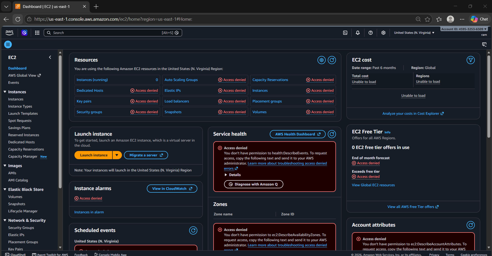

* **DevOps Takeaway:** Verifies AWS's default security baseline—identities have zero access until permissions are explicitly granted.

---

### Step 2 – Create IAM Groups for Team-Based Administration

To implement Role-Based Access Control (RBAC), two IAM user groups were created:
- `devops_team`
- `qa_team`

```
devops_team
    ├── kiran
    └── ram

qa_team
    ├── Anshu
    └── madhu
```

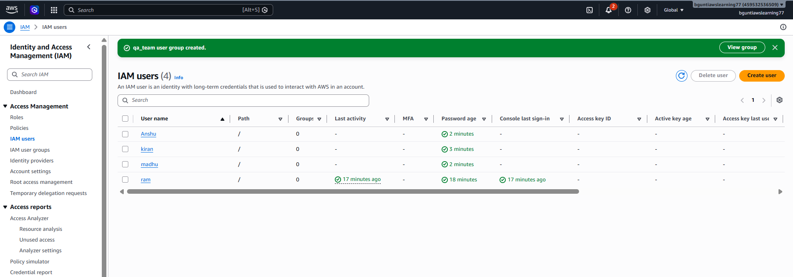
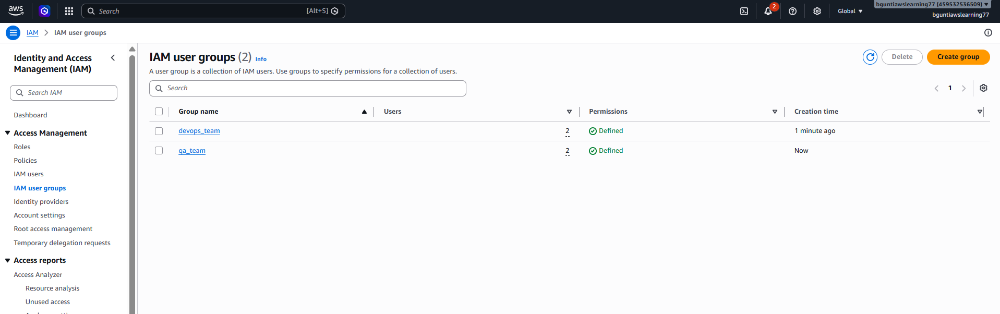

#### Group Membership Assignment:
- **`devops_team` Members:** Assigned users `kiran` and `ram` to handle infrastructure provisioning and maintenance operations.
- **`qa_team` Members:** Assigned users `Anshu` and `madhu` to handle testing, quality assurance, and verification.

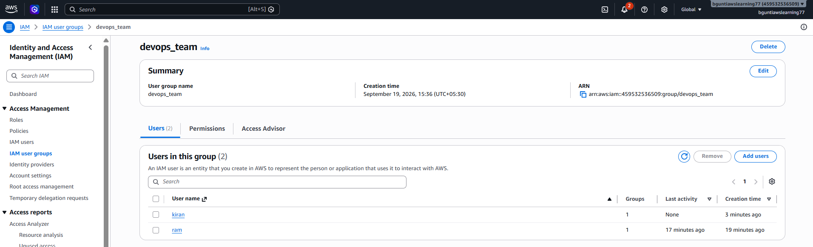
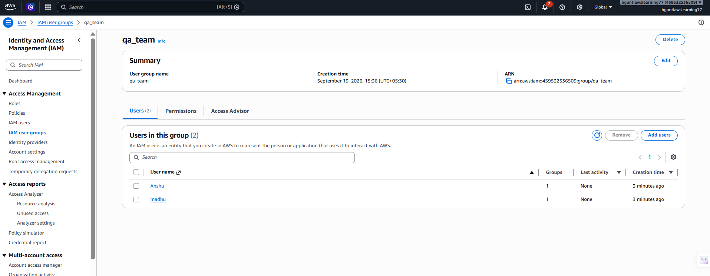

* **DevOps Takeaway:** Group-based permission management provides scalability. When new engineers join a team, onboarding requires adding them to the corresponding group rather than auditing and copying dozens of individual policy attachments.

---

### Step 3 – Attach EC2 Permissions & Provision Resources

To enable compute operations, the AWS managed policy `AmazonEC2FullAccess` was attached to user `ram`.

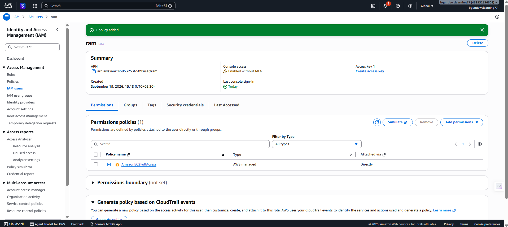

#### Provisioning Verification
Logged in as user `ram`, the user navigated to the EC2 console and successfully launched a virtual server:
- **Instance Name:** `RAM_SERVER`
- **Instance ID:** `i-0abd6ed652b1d77f3`
- **Instance Type:** `t3.micro`
- **Availability Zone:** `us-east-1c`
- **State:** `Running`

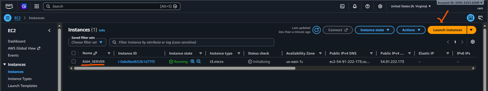

* **DevOps Takeaway:** Broad managed policies allow rapid provisioning during development, but grant full administrative powers over EC2 (including deleting network interfaces, modifying security groups, and terminating servers).

---

### Step 4 – Test Read-Only Access

To evaluate permission restrictions for read-only roles (such as monitoring, security auditing, or QA inspection), `AmazonEC2FullAccess` was removed from user `ram` and replaced with `AmazonEC2ReadOnlyAccess`.

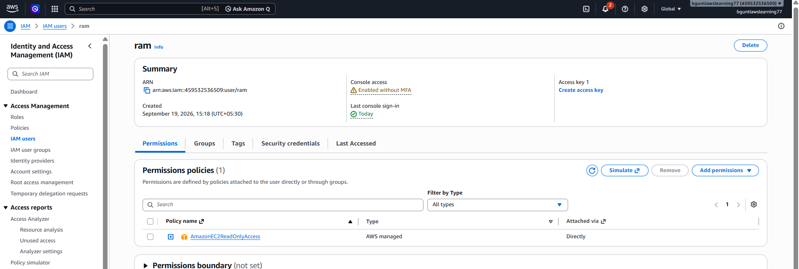

* **DevOps Takeaway:** Read-only policies grant visibility (`Describe*`, `Get*`, `List*`) into cloud infrastructure without permitting disruptive modifications (`RunInstances`, `StopInstances`, `TerminateInstances`). This is ideal for QA teams, auditors, and monitoring dashboards.

---

### Step 5 – Create Custom IAM Policy with Resource-Level Permissions

To implement the **Principle of Least Privilege**, a customer-managed policy named `mc-ec2-start-stop-instance` was created.

#### Policy Design Goals:
1. Allow the user to view instances in the console (`ec2:DescribeInstances` on `*`).
2. Allow the user to start and stop **only** their assigned instance (`i-0abd6ed652b1d77f3`).
3. Explicitly exclude permissions to launch new servers, modify networking, or terminate (delete) the instance.

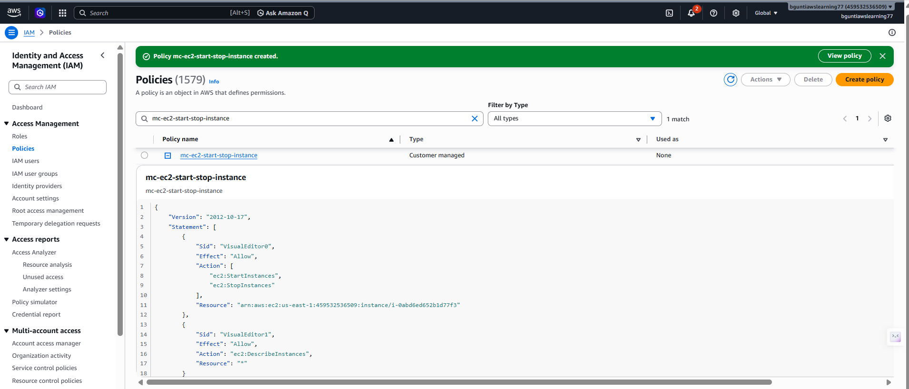

#### Attaching the Custom Policy
The customer-managed policy `mc-ec2-start-stop-instance` was attached directly to user `ram`:

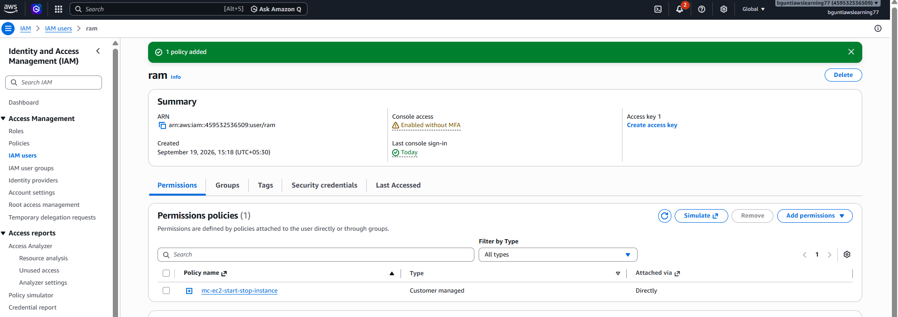

---

### Step 6 – Validate Permissions & Least-Privilege Boundaries

Logged in as user `ram`, testing was conducted against `RAM_SERVER` (`i-0abd6ed652b1d77f3`):

#### 1. Testing Permitted Action: Stop Instance
- User `ram` selected `RAM_SERVER` and executed **Stop instance**.
- **Result:** Successfully transitioned to `Stopping`. The `ec2:StopInstances` action matched the explicit `Allow` statement for this instance ARN.

#### 2. Testing Prohibited Action: Terminate Instance
- User `ram` selected `RAM_SERVER` and attempted **Terminate instance**.
- **Result:** Operation **Failed with Authorization Error**:
  > `Failed to terminate (delete) an instance: You are not authorized to perform this operation. User: arn:aws:iam::459532536509:user/ram is not authorized to perform: ec2:TerminateInstances on resource: arn:aws:ec2:us-east-1:459532536509:instance/i-0abd6ed652b1d77f3 because no identity-based policy allows the ec2:TerminateInstances action.`

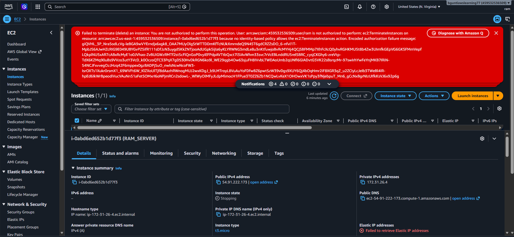

* **DevOps Takeaway:** This confirms that least-privilege security boundaries successfully prevented accidental or unauthorized destruction of infrastructure, while preserving normal day-to-day operational capabilities.

---

## 6. IAM Policy Example

The customer-managed policy implemented in this project restricts actions to specific instance ARNs while maintaining console usability:

```json
{
  "Version": "2012-10-17",
  "Statement": [
    {
      "Sid": "AllowStartStopSpecificInstance",
      "Effect": "Allow",
      "Action": [
        "ec2:StartInstances",
        "ec2:StopInstances"
      ],
      "Resource": "arn:aws:ec2:REGION:ACCOUNT-ID:instance/INSTANCE-ID"
    },
    {
      "Sid": "AllowDescribeInstances",
      "Effect": "Allow",
      "Action": [
        "ec2:DescribeInstances"
      ],
      "Resource": "*"
    }
  ]
}
```

*File location in repository:* [`policies/mc-ec2-start-stop-instance.json`](policies/mc-ec2-start-stop-instance.json)

### Statement Breakdown:
- **`AllowStartStopSpecificInstance`**: Restricts the operational state management actions (`ec2:StartInstances`, `ec2:StopInstances`) strictly to the designated instance ARN. If the user attempts to stop or start any other EC2 instance in the account, the action is denied.
- **`AllowDescribeInstances`**: The AWS Management Console requires `ec2:DescribeInstances` with a wildcard resource (`*`) because the AWS EC2 API does not support resource-level restrictions on general describe/list operations.

---

## 7. Directory Structure

```text
AWS-IAM/
├── README.md
├── IAM_Lab_Documentation.md
├── policies/
│   └── mc-ec2-start-stop-instance.json
└── screenshots/
    ├── 01-iam-user-no-permissions.png
    ├── 02-ec2-dashboard-access-denied.png
    ├── 03-ec2-full-access-policy-attached.png
    ├── 04-ec2-instance-launch-success.png
    ├── 05-iam-users-overview.png
    ├── 06-iam-user-groups.png
    ├── 07-devops-team-group-members.png
    ├── 08-qa-team-group-members.png
    ├── 09-ec2-readonly-policy-attached.png
    ├── 10-custom-policy-creation.png
    ├── 11-custom-policy-attached.png
    └── 12-least-privilege-termination-denied.png
```

---

## 8. DevOps Best Practices & Production Considerations

1. **Enforce Least Privilege Everywhere**:
   Avoid attaching broad managed policies like `AdministratorAccess` or `*FullAccess` to individual user accounts. Scope permissions down to the required service actions and specific resource ARNs.

2. **Prefer Group-Based and Role-Based Governance**:
   Manage human user permissions via IAM Groups and federated Single Sign-On (SSO / IAM Identity Center). For automated workloads and compute (such as EC2 instances or Lambda functions), always use **IAM Roles** and temporary security credentials rather than hardcoded access keys.

3. **Manage IAM via Infrastructure as Code (IaC)**:
   In production environments, IAM users, groups, and policies should be version-controlled and deployed using Terraform, AWS CloudFormation, or AWS CDK to ensure peer review, auditability, and reproducible deployments across multiple environments.

4. **Protect Against Accidental Termination**:
   In addition to IAM restrictions, apply EC2 Termination Protection (`DisableApiTermination`) and resource tags to critical production instances to safeguard against accidental operational commands.

5. **Regular Access Reviews & Credential Hygiene**:
   Utilize IAM Access Advisor and IAM Credential Reports to identify unused credentials, enforce Multi-Factor Authentication (MFA), and deprecate inactive IAM users.
